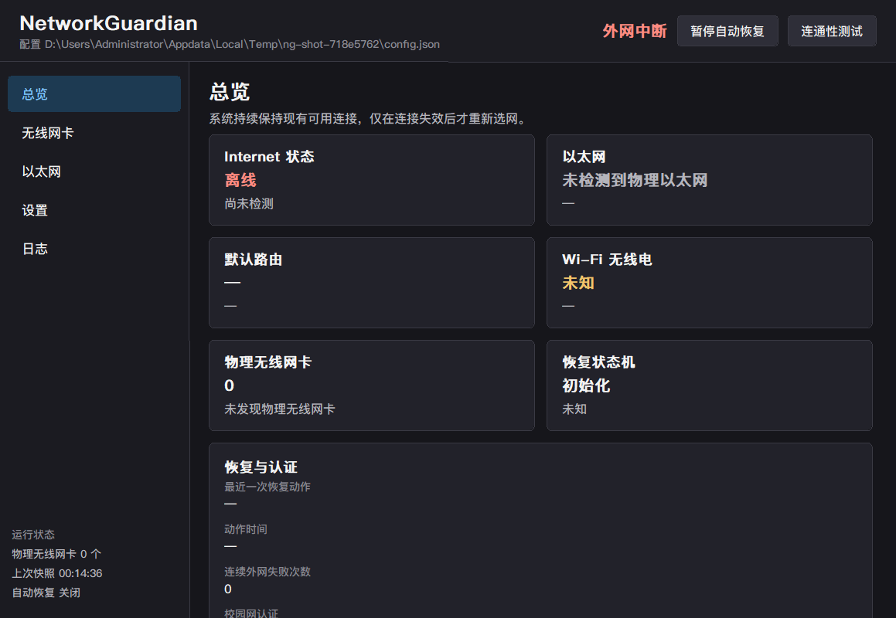
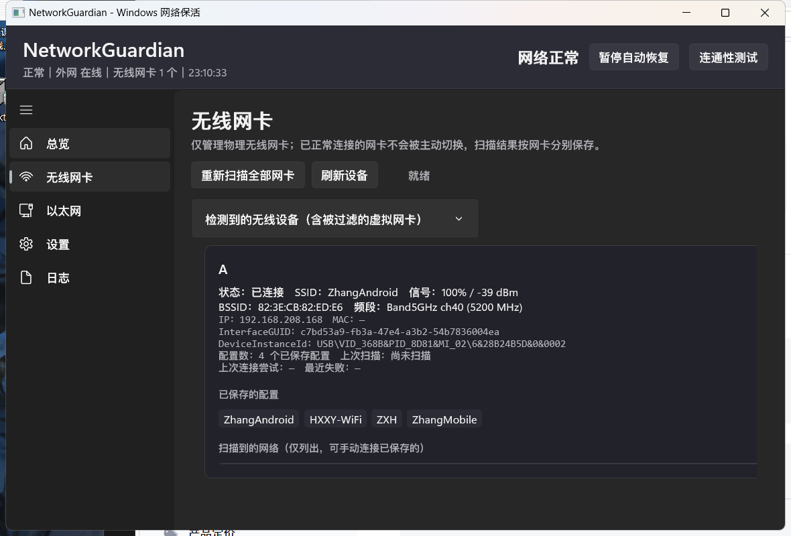
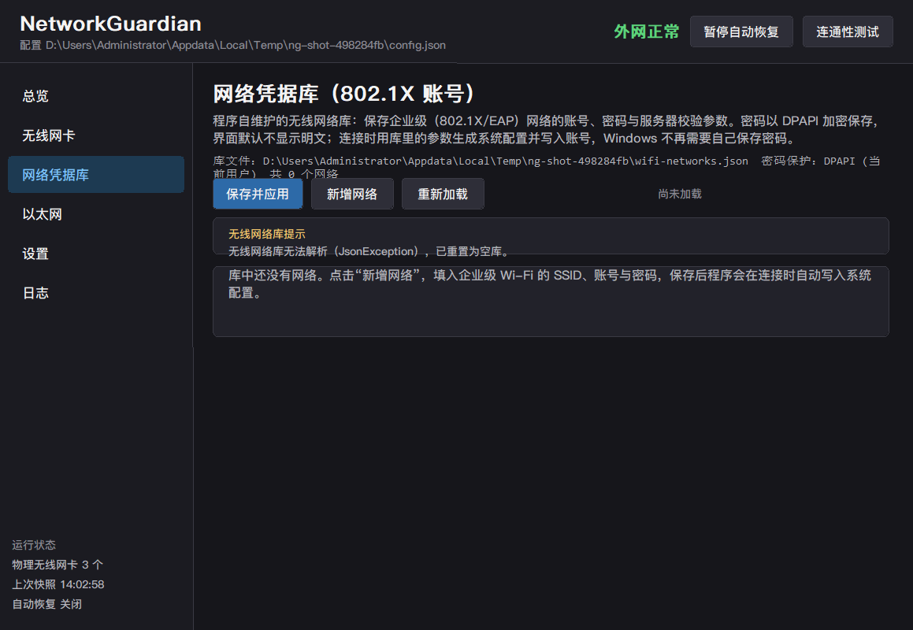
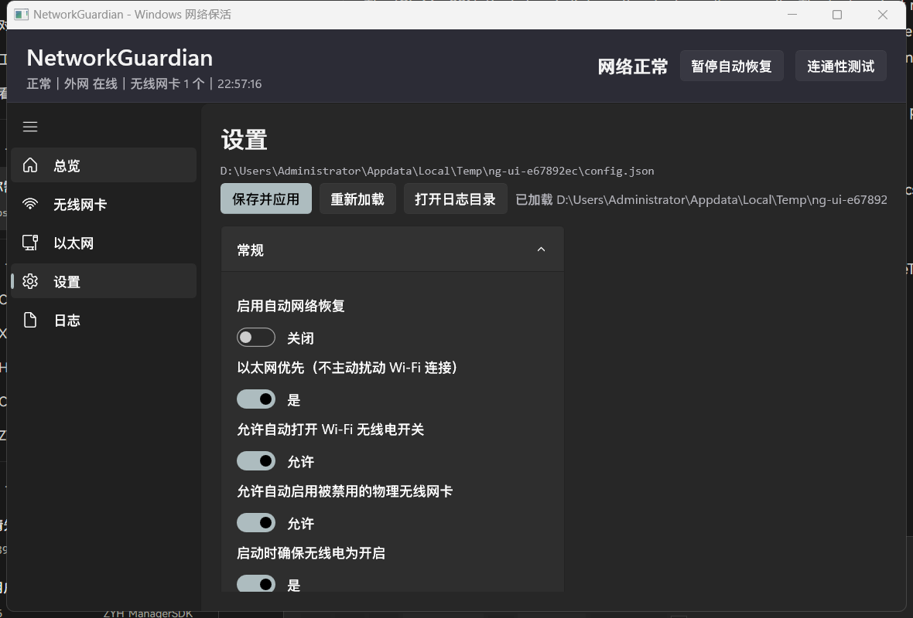

# NetworkGuardian

NetworkGuardian 是面向 Windows 10/11 的网络监测与自动恢复工具。它持续观察物理以太网、物理 Wi-Fi、IP、路由和真实外网可达性，在确认连接失效后执行受限、可追踪的恢复动作。

项目使用 C# / .NET 8，发布为约 8.3 MiB 的 **x64 Native AOT 单文件 EXE**。目标电脑无需安装 .NET、Windows App SDK 或 Visual Studio。

> 核心原则：保持已经可用的连接，只在连接真正失效时做最小必要操作。



## 功能概览

| 能力 | 行为 |
| --- | --- |
| 外网探测 | 组合 TCP、HTTP(S)、DNS 和可选 ICMP，不把“网卡已连接”误认为互联网可用 |
| 出口验证 | 调用系统已有的 Npcap，在目标物理接口确认探测请求与回包确实经过该网卡 |
| 粘性连接 | 当前连接可用时不切换，不因另一网络信号更强而中断业务 |
| 多网卡恢复 | 每块物理 Wi-Fi 独立扫描、判断和连接 |
| 安全选网 | 默认只连接 Windows 已保存的 Profile，不加入陌生网络 |
| 候选排序 | 按信号、5/6 GHz 加分和最近成功 Profile 加分排序 |
| SSID 去重 | 默认不允许多张网卡同时连接同一 SSID |
| 无线电恢复 | 打开 Windows Wi-Fi 总开关和每块网卡的软件无线电 |
| PnP 恢复 | 仅启用确认过的物理 Wi-Fi；故障设备可做受限的禁用/启用重启 |
| 802.1X 凭据库 | DPAPI 加密企业 Wi-Fi 密码，按需生成 Profile 和 EAP 用户凭据 |
| 校园网认证 | 外网失败或认证页拦截时运行客户端/命令，带超时和频率限制 |
| 配置与日志 | JSON 原子写入、备份、损坏隔离、滚动日志和界面实时日志 |
| 操作反馈 | 扫描、测试、保存、连接等耗时操作显示进度并阻止重复点击 |

## 快速开始

### 系统要求

- Windows 10 2004（build 19041）或更高，x64。
- 日常运行不需要管理员权限。
- 启用或重启 PnP 设备时会按需显示 UAC。
- 严格出口验证需要用户自行安装 Npcap；软件不内置、不下载也不静默安装 Npcap。

### 使用发布版

1. 运行 `release\NetworkGuardian.exe`。
2. 从托盘打开窗口。
3. 在“设置”页检查探测端点、自动恢复和 Wi-Fi 策略。
4. 企业 Wi-Fi 用户在“网络凭据库”中添加账号及 EAP 参数。

首次运行会创建：

```text
%LOCALAPPDATA%\NetworkGuardian\
├── config.json
├── config.backup.json
├── state.json
├── wifi-networks.json
├── Logs\
└── helper\
```

默认策略偏保守：保持现有连接、只使用已保存 Profile、不修改接口度量、所有恢复动作均有限流。

## 界面说明

- **总览**：全局探测、默认路由、以太网、Wi-Fi、状态机、本轮动作及决策原因。
- **无线网卡**：按网卡显示 SSID、BSSID、信号、频段、IP、MAC、Profile 和扫描结果，可手动扫描/连接/断开。
- **网络凭据库**：管理企业 Wi-Fi 的账号、DPAPI 密码、EAP 方法、服务器和证书参数。
- **以太网**：只读展示链路、地址、网关、DNS、MAC、Metric 和接口探测。
- **设置**：先编辑工作副本，点击“保存并应用”后才写入并生效。
- **日志**：按级别、分类和关键字筛选，支持自动滚动和打开日志目录。





## 工作机制与原理

```text
枚举设备/接口
  ↓
采集链路、地址、路由、WLAN、Profile、无线电
  ↓
分层竞速探测 + 严格按接口探测
  ↓
连续失败达到阈值？──否→保持现状
  │
  是
  ↓
无线电 → 设备 → 认证 → 扫描 → 候选分配 → 连接 → DHCP → 复测
  ↓
成功：清除失败状态
失败：黑名单、指数退避、冷却或熔断
```

### 原生数据来源

核心逻辑不依赖命令行文本解析：

- Native Wi-Fi：接口、扫描、Profile、连接、断开和通知。
- Configuration Manager / SetupAPI：PnP 设备、Problem Code、父设备和设备启用。
- IP Helper API：地址、接口、路由和默认网关。
- Windows Radio Manager：每块 Wi-Fi 的软件无线电。
- Win32 消息：设备变化、休眠唤醒、窗口和托盘。

设备/WLAN 通知会触发即时刷新；默认每 20 秒健康巡检、每 90 秒完整枚举。休眠唤醒后先等待网络栈稳定再判断。

外网探测把结果分为 `InternetVerified`、`InternetLikely`、`CaptivePortal`、`LocalOnly` 和
`Unknown`。HTTP 固定正文/204 与 HTTPS 成功属于强证据；TCP、DNS 和 ICMP 只能提供较弱的
传输层或局域网证据。并发端点一旦形成强结论就立即取消较慢请求。健康状态使用正常周期，
失败或认证门户状态缩短重试周期，不确定状态采用中间周期。

按接口探测的 DNS、TCP、HTTP 和 HTTPS 套接字同时绑定该接口的源 IPv4 与 Windows 接口索引；
DNS 查询直接发送到该接口配置的 DNS 服务器。无法指定出口的系统 Ping 不参与按接口结论，
避免 A 网卡借用 B 网卡的连通性而被误判为可上网。

启动时软件会动态加载系统已有的 `Npcap\wpcap.dll`，并把 Windows 网卡 GUID 映射到 Npcap
捕获设备。每轮按接口探测只在目标网卡开启非混杂抓包，并用内核 BPF 限定源 IPv4 和探测
端口；只有同时捕获到出站请求与入站回包，强结论才保留为 `InternetVerified`。Npcap 缺失时
会弹窗提示用户手动安装，程序仍可运行，但只能依赖套接字绑定证据，界面明确显示未完成抓包
验证；Npcap 已加载但无法打开目标接口或未捕获到完整双向流量时，结论降级为
`InternetLikely`，不会把它用于严格的“该网卡有外网”判定。

### 恢复状态机

典型状态包括 `Healthy`、`EthernetNoInternet`、`Authenticating`、`WifiRadioOff`、`EnablingWifiDevices`、`WifiScanning`、`WifiConnecting`、`WaitingForDHCP`、`VerifyingInternet`、`Cooldown`、`Paused` 和 `Degraded`。每次转换都记录原因与时间。

### 防止恢复风暴

- 默认连续失败 3 次才认定断网，连续成功 2 次才退出恢复。
- 同一网卡自动扫描至少间隔 25 秒。
- 连接失败 Profile 默认进入 180 秒黑名单。
- 指数退避从 5 秒开始，最高 600 秒。
- 自动恢复轮次默认冷却 45 秒。
- 同类操作连续失败会触发熔断。
- 设备、认证客户端和离线命令均有独立次数限制。

## Wi-Fi 选择与多网卡分配

只有网卡未连接，或当前连接连续探测失败且允许恢复陈旧连接时，才会重新选网。

候选必须满足：存在可用 Profile、不在黑名单、符合 SSID 白/黑名单、驱动报告可连接；企业网络还必须有凭据库条目且未耗尽 EAP 重试次数。

评分公式：

```text
score = signalQuality
      + highBandBonus       # 默认 8，5/6 GHz
      + recentProfileBonus  # 默认 6，最近成功 Profile
```

例如 `Office-2G` 信号 82 分；`Office-5G` 信号 77 + 高频 8 = 85 分，因此后者优先。但若当前已经通过 `Office-2G` 正常联网，粘性策略会保持它，不切换。

多网卡默认禁止重复 SSID：已经被一张网卡占用的 SSID 会从其他网卡候选中排除；检测到重复连接时保留信号更好的一张。

## 外网探测与认证页识别

默认端点包含 Microsoft NCSI HTTP/HTTPS、阿里 DNS TCP、DNSPod TCP 和公共域名解析。一轮并发探测只需达到 `requiredSuccessCount` 即判定在线。

HTTP(S) 同时检查状态码、可选正文标记和重定向；未跟随的 3xx 通常表示 Captive Portal。开启 `perInterfaceProbing` 后，每个 Up 接口单独探测，避免另一张正常网卡掩盖故障网卡。

内网环境应把默认公共端点替换成稳定的内部目标。例如：

```json
{
  "probe": {
    "requiredSuccessCount": 2,
    "perInterfaceProbing": true,
    "detectCaptivePortalRedirects": true
  },
  "probeEndpoints": [
    { "name": "Gateway", "kind": "tcp", "target": "10.0.0.1:443", "timeoutMs": 1000 },
    { "name": "Health", "kind": "https", "target": "https://example.com/health", "bodyMarker": "ok" }
  ]
}
```

## 802.1X/EAP 网络凭据库

WLAN Profile 描述安全方式和 EAP 参数；账号密码必须通过 `WlanSetProfileEapXmlUserData` 单独写入，不能直接放进 Profile XML。

NetworkGuardian 的 `wifi-networks.json` 因此独立保存：

- 密码由当前 Windows 用户的 DPAPI 加密，明文 `password` 不序列化。
- 支持生成 PEAP + MSCHAPv2 和 EAP-TLS 配置。
- EAP-TTLS、厂商方案或特殊证书选择可提供自定义 XML。
- 条目改变后，下次连接会重写系统 Profile 和用户凭据。
- 每个“接口 + SSID”默认最多 5 次 EAP 失败，耗尽后本次运行不再尝试。
- 修改该条目会立即清除相应失败计数。

使用示例：扫描到 `Campus-8021X` → 在凭据库选择它 → 填写身份/密码 → 保存并应用 → 写入所有无线网卡或等待自动连接。详见 [EAP 凭据库设计](docs/eap-credential-library.md)。

## 校园网认证与离线命令

认证客户端示例：

```json
{
  "campusAuth": {
    "enabled": true,
    "name": "校园网认证",
    "kind": "executable",
    "executablePath": "D:\\Campus\\AuthClient.exe",
    "arguments": "--auto",
    "runAsAdministrator": true,
    "triggerAfterConsecutiveFailures": 3,
    "minIntervalSeconds": 300,
    "maxRunsPerHour": 6,
    "executionTimeoutSeconds": 60,
    "skipIfAlreadyRunning": true,
    "runOnCaptivePortal": true,
    "requireEthernetLink": true
  }
}
```

离线命令示例：

```json
{
  "offlineCommands": [{
    "id": "renew-address",
    "name": "更新地址",
    "enabled": true,
    "kind": "shell",
    "executablePath": "ipconfig /renew",
    "windowStyle": "hidden",
    "executionTimeoutSeconds": 30,
    "minIntervalSeconds": 600,
    "maxRunsPerHour": 3,
    "maxConsecutiveRuns": 2,
    "waitForExit": true,
    "waitAfterRunSeconds": 8
  }]
}
```

`executable` 直接启动程序；`shell` 通过 `cmd.exe /c` 执行整行。参数不会写入日志，避免泄露口令。

## 设备识别、恢复与提权

程序综合 PnP 枚举器、总线、驱动服务、NDIS PhysicalMediaType、硬件 ID 和 `wlansvc` GUID 关联判断物理设备。`ROOT\`、`SWD\`、Wi-Fi Direct、VMware、Hyper-V、VirtualBox、TAP/TUN/Wintun/WireGuard 等虚拟设备会被过滤，规则和原因显示在界面及日志中。

只有当前存在、被确认是物理 Wi-Fi、且 Problem Code 表示禁用的设备才会调用 `CM_Enable_DevNode`。Code 10/43 等驱动故障可执行受限的“禁用 + 启用”；持续失败时应重装或回滚驱动。

主进程始终普通权限运行。提权助手编译在同一个 EXE 中，仅在需要时以 `NetworkGuardian.exe --helper` 启动并请求 UAC，且会重新验证目标设备。

## 配置文件

配置位于 `%LOCALAPPDATA%\NetworkGuardian\config.json`，当前 Schema 为 v5。推荐使用设置页修改。保存采用临时文件和原子替换；损坏文件会隔离为 `config.invalid.json`，然后使用备份或默认值。

| 区域 | 重要默认值 |
| --- | --- |
| `general` | 自动恢复开；无线电看门狗 3s；健康巡检 20s；完整枚举 90s；不管理 Metric |
| `recovery` | 失败阈值 3；恢复阈值 2；冷却 45s；连接黑名单 180s |
| `probe` | 间隔 15s；单次超时 2500ms；轮次预算 8000ms；按接口探测开 |
| `wifi` | 粘性连接开；只用已保存 Profile；高频优先；重复 SSID 关闭 |
| `ethernet` | 链路 Up 但离线时允许认证 |
| `startup` | 启动最小化、最小化到托盘、关闭按钮隐藏 |
| `logging` | Information；保留 7 天；最多 20 个文件 |

SSID 规则示例：

```json
{
  "wifi": {
    "ssidAllowList": ["Office-5G", "Backup"],
    "ssidDenyList": ["Office-Guest"],
    "onlySavedProfiles": true
  }
}
```

### 典型模式

双 Wi-Fi、避免同 SSID：

```json
{ "wifi": { "stickyConnection": true, "allowSameSsidOnMultipleAdapters": false, "onlySavedProfiles": true } }
```

只监控、不自动修复：

```json
{ "general": { "automaticRecovery": false, "radioWatchdogEnabled": false, "manageInterfaceMetrics": false } }
```

被误关的软件无线电自动恢复：

```json
{ "general": { "automaticRecovery": true, "autoEnableWifiRadio": true, "radioWatchdogEnabled": true, "radioWatchdogSeconds": 3 } }
```

## 文件、日志与安全边界

- `config.json`：主配置；`config.backup.json`：有效备份。
- `state.json`：非敏感运行状态。
- `wifi-networks.json`：802.1X 库，密码为 DPAPI 密文。
- `Logs\networkguardian-*.log`：滚动日志。
- `helper\request/response-*.json`：临时提权通信。

安全原则：不自动加入陌生 Wi-Fi；不记录密码/EAP 密钥/外部命令参数；默认不改 Metric；不切换可用连接；主进程不常驻管理员权限；所有潜在循环动作均有限流。

DPAPI 密文绑定当前 Windows 用户。复制凭据库到另一台电脑或另一用户后通常无法解密，应重新录入。

## 命令行

```powershell
NetworkGuardian.exe
NetworkGuardian.exe --visible
NetworkGuardian.exe --minimized
NetworkGuardian.exe --page wireless
```

页面：`dashboard | wireless | credentials | ethernet | settings | logs`。

测试环境变量：

| 变量 | 用途 |
| --- | --- |
| `NETWORKGUARDIAN_CONFIG_ROOT` | 重定向全部数据到隔离目录 |
| `NETWORKGUARDIAN_INSTANCE_SUFFIX` | 允许测试实例与正式实例并存 |
| `NETWORKGUARDIAN_HELPER_PATH` | 测试时替换助手路径 |
| `NETWORKGUARDIAN_WIFI_HARDWARE_TESTS=1` | 显式启用真实 WLAN 硬件测试 |

## 构建、测试与发布

编译机需要 .NET SDK 8+、VS Build Tools/MSVC 链接器和 Windows SDK。

```powershell
dotnet build NetworkGuardian.sln -c Release
dotnet test tests\NetworkGuardian.Tests\NetworkGuardian.Tests.csproj -c Release
pwsh -NoProfile -File tools\build-portable.ps1
pwsh -NoProfile -File tools\build-portable.ps1 -Zip
pwsh -NoProfile -File tools\verify-portable.ps1
```

`build-portable.ps1` 执行 0 警告构建、全部常规测试、win-x64 Native AOT 发布、单 EXE/PDB 检查和 8.5 MiB 体积门禁。输出：

```text
release\NetworkGuardian.exe
release\发布说明.txt
```

UI 与运行测试：

```powershell
pwsh -NoProfile -File tools\ui-screenshot.ps1 -Page dashboard -Out docs\ui-dashboard.png
pwsh -NoProfile -File tools\smoke-run.ps1 -Seconds 25
pwsh -NoProfile -File tools\shutdown-test.ps1
```

## 故障排查

### 显示外网中断，但浏览器可用

检查日志中的失败端点、代理/DNS/防火墙和认证页。单位内网应使用内部 HTTPS/TCP/DNS 目标替换公共默认端点。

### 不连接某个 Wi-Fi

检查是否有当前接口可见的 Profile、是否命中名单、是否被另一网卡占用、驱动是否报告不可连接、是否处于失败黑名单；企业网络还要检查凭据库和 EAP 重试状态。

### 无法启用网卡

确认它被识别为物理 Wi-Fi并查看 Problem Code。Code 22 是典型禁用；Code 10/43 通常是驱动问题。接受 UAC 后查看助手结果。

### 无线电无法打开

硬件开关、飞行模式策略、组策略或驱动故障可能拒绝软件控制。程序会区分权限、策略、硬件和接口错误，不会无限重试。

### 配置未生效

设置页必须点击“保存并应用”。手工编辑后点击“重新加载”或重启。无效数值会被规范化并记录提示。

### 关闭窗口后仍运行

默认关闭按钮只隐藏到托盘。通过托盘菜单退出，或关闭 `startup.closeToTray`。

## 项目结构

```text
src\NetworkGuardian.Core            配置、模型、策略、状态机、EAP 生成
src\NetworkGuardian.Windows         WLAN、PnP、路由、无线电、DPAPI、托盘
src\NetworkGuardian.Infrastructure  JSON、日志、进程执行
src\NetworkGuardian.Portable        生命周期、自绘 Win32/GDI UI、单文件入口
tests\NetworkGuardian.Tests         单元、契约、互操作和可选硬件测试
tools                                构建、验证、截图和 QA 脚本
docs                                 设计和专题记录
```

自绘 Win32 UI 避免引入 WinUI / Windows App SDK 的大量运行时文件；Native AOT、源生成 JSON 和直接 P/Invoke 共同实现小体积单文件。

## 延伸文档

- [文档索引](docs/README.md)
- [802.1X/EAP 凭据库](docs/eap-credential-library.md)
- [小体积发布方案](docs/portable-small-build-plan.md)
- [Native AOT 实施记录](docs/session-log-2026-09-18.md)
- [802.1X 真机记录](docs/session-log-2026-09-18-8021x.md)

当前版本：`0.9.0`；配置 Schema：`v5`；目标：`win-x64`。
