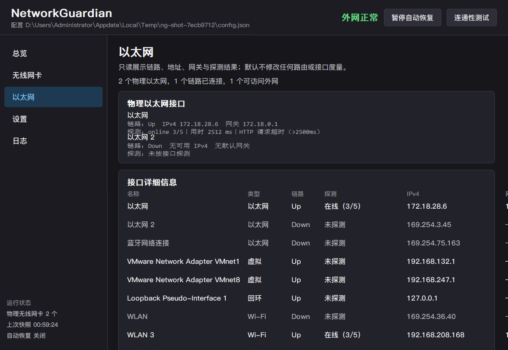
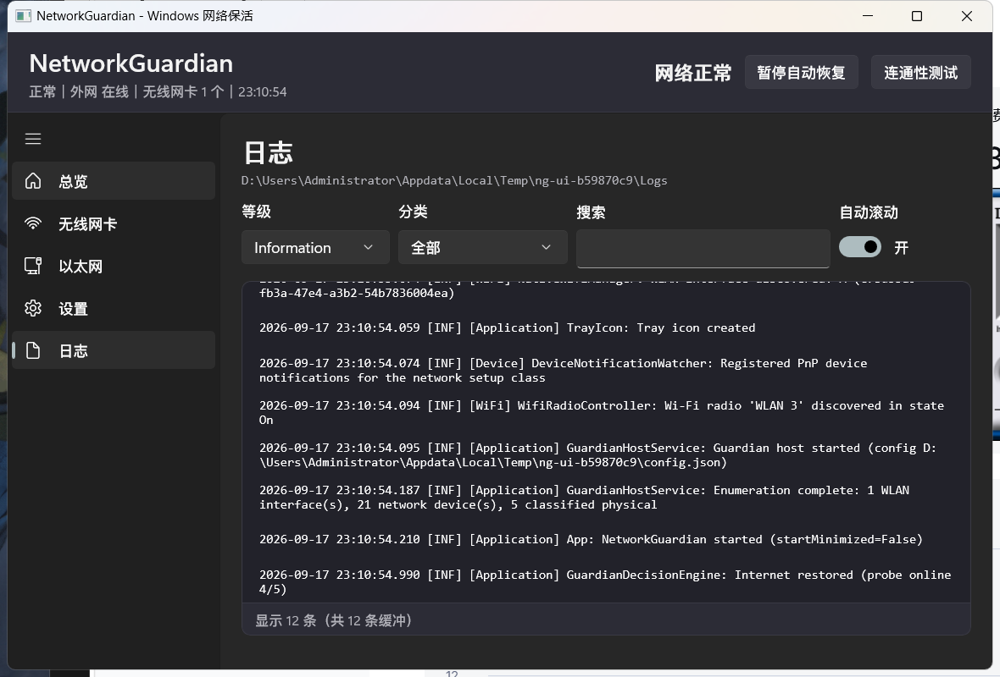

# NetworkGuardian

NetworkGuardian 是面向 Windows 10/11 的网络监测与自动恢复工具。它持续采集物理以太网、物理 Wi-Fi、IP、路由、无线电和真实外网可达性，在连接被确认失效后执行受限、可追踪的恢复动作。

当前版本使用 C# / .NET 8，发布为 **win-x64 Native AOT 单文件 EXE**。实测发布文件约 8.95 MiB，目标电脑无需安装 .NET、Windows App SDK 或 Visual Studio。

> 核心原则：保持已经可用的连接；只有在探测证据和连续失败阈值同时满足时，才执行最小必要动作。


## 当前版本

| 项目 | 当前值 |
| --- | --- |
| 应用版本 | `0.9.0` |
| 配置 Schema | `v12` |
| 目标平台 | Windows 10/11 x64 |
| 发布形式 | Native AOT 单 EXE，提权助手内置 |
| 实测 EXE 大小 | 8.95 MiB |
| 发布体积门禁 | 9.0 MiB |
| 常规测试 | 306 项 |
| 发布包验收 | 33 项 |

## 功能概览

| 能力 | 当前行为 |
| --- | --- |
| 外网探测 | 并发执行 HTTP、HTTPS、TCP、DNS 和可选 ICMP；链路 Up 不等于互联网可用 |
| 按接口探测 | 将套接字绑定到目标接口的源 IPv4 和 Windows 接口索引，分别判断每条线路 |
| Npcap 出口验证 | 在目标物理接口捕获探测请求与回包，同时记录双向一致的二层下一跳 MAC |
| 有线优先 | 自动设置以太网/Wi-Fi 接口 Metric，并在高优先级线路恢复稳定后延迟回切 |
| 备用线路去同源化 | 健康有线作为出口时，备用 Wi-Fi 优先选择不同网关、不同 Npcap 下一跳或非校园网络 |
| 粘性连接 | 当前 Wi-Fi 可用时不因其他网络信号更强而切换 |
| 多网卡分配 | 每块物理 Wi-Fi 独立扫描、选择候选和连接；默认避免重复 SSID |
| 安全选网 | 默认只使用 Windows 已保存的 Profile 或用户明确加入凭据库的网络 |
| 无线电恢复 | 启动时确保无线电开启，并每 3 秒检查每块 Wi-Fi 的软件无线电 |
| PnP 恢复 | 启用被禁用的物理有线/Wi-Fi；对 Code 10/43 等驱动故障执行受限重启 |
| Wi-Fi 凭据库 | DPAPI 加密个人网和 802.1X/EAP 凭据，按目标网卡生成 Windows Profile |
| 校园网认证 | 外网失败或认证页拦截时运行已配置的认证客户端/命令，带超时、限流和验证 |
| 配置与日志 | JSON 原子写入、有效备份、损坏隔离、滚动日志和实时日志页 |

## 系统要求

- Windows 10 2004（build 19041）或更高版本，x64。
- 日常监测、扫描、连接和无线电管理不需要管理员权限。
- 启用或重启 PnP 设备时会按需请求 UAC；操作完成后提权进程立即退出。
- 严格出口验证需要用户自行安装 Npcap。程序不内置、不下载、不静默安装 Npcap。
- Windows 11 读取 SSID、BSSID、RSSI 和信道通常需要开启“定位服务”和“让桌面应用访问你的位置”。

## 快速开始

1. 运行 `release\NetworkGuardian.exe`。
2. 从托盘打开主窗口。
3. 在“设置”页确认自动恢复、接口 Metric、探测端点和 Wi-Fi 策略。
4. 在“网络凭据库”中添加需要自动使用的个人网、开放网或企业网。
5. 点击“保存并应用”。设置页的修改在保存前只存在于工作副本。

首次运行默认创建：

```text
%LOCALAPPDATA%\NetworkGuardian\
├── config.json
├── config.backup.json
├── state.json
├── wifi-networks.json
├── Logs\
└── helper\
```

默认策略是：自动恢复开启、有线优先、自动管理接口 Metric、按接口探测开启、保持正常连接、只连接已保存网络、恢复动作全部限流。

## 界面

- **总览**：全局外网状态、当前默认出口、以太网、Wi-Fi、Npcap 验证、恢复状态和决策原因。
- **无线网卡**：显示物理 Wi-Fi、SSID、BSSID、信号、频段、IP、MAC、Profile 和扫描结果；支持手动扫描、连接和断开。
- **网络凭据库**：管理开放网、WEP、WPA/WPA2/WPA3-Personal、OWE 和企业 802.1X/EAP 网络。
- **以太网**：只读显示物理以太网的链路、地址、网关、DNS、Metric 和独立探测结果。
- **设置**：编辑配置工作副本；保存后原子写入 `config.json` 并立即应用。
- **日志**：按级别、分类和关键字筛选，支持自动滚动和打开日志目录。





## 工作流程

```text
枚举 PnP 设备、网络接口和 WLAN 状态
  ↓
采集链路、IPv4、网关、路由、Metric、Profile 和无线电
  ↓
全局并发探测 + 每接口绑定探测 + 可选 Npcap 双向验证
  ↓
连续失败达到阈值？──否→保持当前连接
  │
  是
  ↓
无线电 → PnP 设备 → 校园认证 → 扫描 → 候选分配 → 连接 → DHCP → 复测
  ↓
成功：连续成功确认 + 高优先级线路稳定观察
失败：Profile 黑名单 + 指数退避 + 冷却 + 熔断
```

设备/WLAN 通知会触发即时刷新；默认每 20 秒执行健康巡检，每 90 秒重新完整枚举设备。系统从睡眠或快速启动恢复后，先等待 8 秒再信任网络栈状态。

## 外网探测和出口验证

外网结果分为：

- `InternetVerified`：存在强应用层成功，并且需要时已由 Npcap 证明流量经过目标接口。
- `InternetLikely`：套接字探测成功，但缺少严格抓包证明。
- `CaptivePortal`：HTTP 被重定向或正文不符合预期。
- `LocalOnly`：只有局域网、网关、DNS、TCP 或 ICMP 等弱证据。
- `Unknown`：证据不足或探测未完成。

默认并发探测 Microsoft NCSI、Baidu、Bing、QQ、Android/MIUI 204 等 HTTP(S) 端点。TCP、DNS 和 ICMP 端点可以启用，但 ICMP 只用于诊断，不单独证明互联网可用。

按接口探测会同时绑定：

- 目标接口的源 IPv4；
- Windows 接口索引；
- 该接口自己的 DNS 服务器。

因此不会把“Wi-Fi 实际完成了请求”误判成“以太网可上网”。

Npcap 可用时，程序动态加载系统 `Npcap\wpcap.dll`，把 Windows 网卡 GUID 映射到 Npcap 设备，并执行非混杂抓包。BPF 只保留目标源 IPv4 的 DNS、HTTP 和 HTTPS 探测流量；必须同时看到出站请求和入站回包，才能保留严格在线结论。双向以太网帧指向同一设备时，还会记录二层下一跳 MAC，用于判断有线和备用 Wi-Fi 是否实际经过同一路由器。

Npcap 缺失时程序仍可运行，但界面会明确标注未完成抓包验证；Npcap 已加载但目标接口无法打开、链路层不是 Ethernet，或没有捕获到完整双向流量时，不会伪造严格验证成功。

## 有线优先、故障切换和恢复回切

默认启用接口 Metric 管理：

```text
以太网 InterfaceMetric = 10
Wi-Fi  InterfaceMetric = 35
```

Metric 只决定 Windows 路由优先级，不代替外网探测。物理以太网保持 Link Up、IPv4 和默认网关，但外网连续失败 3 次时，程序会认定有线不可用；可用的手机热点或其他 Wi-Fi 随后成为实际出口。

有线恢复后不会根据一次成功立即回切。默认需要：

1. 连续成功 2 次；
2. 高优先级接口稳定至少 6 秒；
3. Npcap 启用时，探测流量确实经过恢复的有线接口。

这样可以避免路由器 WAN 刚恢复时反复在有线和 Wi-Fi 之间抖动。

### 真机测试：路由器 WAN → 手机热点 → 路由器 WAN

测试目的不是验证“网线被拔掉”，而是验证“有线链路仍在，但有线外网失效”。

准备条件：

- 电脑 LAN 网线保持连接，`Get-NetAdapter` 中以太网必须一直为 `Up`。
- 手机热点已经保存并连接，且热点使用蜂窝数据，不能通过被测路由器回流上网。
- 自动恢复、以太网优先、按接口探测和接口 Metric 管理均已开启。
- 临时关闭 VPN、透明代理和可能改变出口的分流软件，或确保 `NetworkGuardian.exe` 直连。

正确的断网方式：

- 在路由器管理页面断开 WAN/PPPoE；或
- 拔掉路由器 WAN 口的上联网线。

不要拔电脑到路由器的 LAN 网线，也不要禁用电脑的以太网卡；否则测试的是链路断开，不是 WAN 故障切换。

观察系统原始数据：

```powershell
Get-NetAdapter | Format-Table Name, Status, LinkSpeed

Get-NetRoute -AddressFamily IPv4 |
  Where-Object DestinationPrefix -eq '0.0.0.0/0' |
  Sort-Object RouteMetric |
  Format-Table ifIndex, NextHop, RouteMetric, InterfaceMetric

curl.exe --noproxy "*" https://api.ipify.org
```

验收顺序：

1. 断开路由器 WAN，以太网仍应显示 `Up`。
2. 日志出现有线接口外网探测连续失败，但不是链路断开。
3. 实际公网 IP 变成手机运营商出口，默认流量由 Wi-Fi 承担。
4. 恢复路由器 WAN。
5. 日志出现有线连续成功和稳定观察；不会一次成功就立即回切。
6. 公网 IP 回到宽带出口，以太网重新成为优先路径。

## Wi-Fi 选择与多网卡分配

只有网卡未连接，或者当前连接持续离线达到 `staleConnectionSeconds` 且允许恢复陈旧连接时，才重新选网。

候选必须满足：

- 存在 Windows Profile 或可用的凭据库条目；
- 不在短期失败黑名单；
- 符合 SSID 白名单/黑名单；
- 驱动报告当前可连接；
- 需要 EAP 时存在完整凭据，且没有耗尽本次运行的重试次数。

候选评分：

```text
score = signalQuality
      + highBandBonus       # 默认 8，适用于 5/6 GHz
      + recentProfileBonus  # 默认 6，最近成功 Profile
```

粘性连接优先于评分：当前网络已经稳定在线时，不因其他网络高几分就中断业务。

默认不允许多张 Wi-Fi 同时连接同一 SSID。检测到重复 SSID 时保留信号更好的一张，另一张关闭该 Profile 的自动连接后释放，并在后续周期选择其他已保存网络。

### 健康有线出口下的备用 Wi-Fi 去同源化

Schema v12 默认开启 `wifi.diversifyFromHealthyEthernet`。当物理以太网是健康默认出口时，非出口 Wi-Fi 会尽量避免连接到同一个上游：

- 配置为校园网络的 SSID 视为与校园有线同源；
- 有线与该 SSID 学习到的默认网关相同，视为同源；
- 有线与该 SSID 的 Npcap 下一跳 MAC 相同，视为同源。

如果扫描中存在不同上游的已保存网络，例如手机热点，程序会释放同源备用 Wi-Fi，并在下一周期连接独立网络。如果没有可用的独立候选，同源网络仍可作为最后的故障兜底，不会为了“去同源”让网卡永久空闲。

## Wi-Fi 凭据库

`wifi-networks.json` 独立于 Windows Profile，支持：

- 开放网络；
- WEP；
- WPA/WPA2/WPA3-Personal；
- Enhanced Open（OWE）；
- PEAP + MSCHAPv2；
- EAP-TLS；
- 自定义 EAP Profile XML 和用户数据 XML。

个人网密码和企业网密钥由当前 Windows 用户的 DPAPI 加密；库文件不序列化明文 `password`。连接前，程序根据目标 Wi-Fi 网卡生成或更新 Windows Profile；802.1X 用户凭据通过 `WlanSetProfileEapXmlUserData` 单独写入。

每个“接口 + SSID”默认最多允许 5 次 EAP 连接失败。达到上限后，本次运行不再尝试；修改对应凭据库条目会立即清除该条目的失败计数。

DPAPI 密文绑定当前 Windows 用户。把凭据库复制到其他电脑或其他用户后通常无法解密，应重新录入。

详见 [802.1X/EAP 凭据库](docs/eap-credential-library.md)。

## 无线电和物理设备恢复

程序通过 Windows Radio Manager 读取每块 Wi-Fi 的软件无线电。默认看门狗每 3 秒检查一次；软件无线电被关闭时会立即重新打开。硬件开关关闭、飞行模式策略或驱动拒绝操作时，只记录真实失败原因，不循环谎报成功。

PnP 恢复只针对当前存在、分类为物理以太网或物理 Wi-Fi 的设备：

- Problem Code 21/22：尝试启用设备；
- Code 10/43 等驱动启动故障：执行受限的“禁用 + 启用”重启；
- `ROOT\`、`SWD\`、Wi-Fi Direct、VMware、Hyper-V、VirtualBox、TAP/TUN、Wintun 和 WireGuard 等虚拟设备会被过滤。

主程序保持普通权限。需要 PnP 权限时，同一个 `NetworkGuardian.exe` 通过 `--helper` 请求 UAC；助手会重新验证设备身份、执行单个操作、写入响应后退出。

## 校园网认证与离线命令

校园认证默认关闭。启用后，只有达到连续失败阈值、命中认证页，或满足配置的链路条件时，才运行指定客户端或命令。

```json
{
  "campusAuth": {
    "enabled": true,
    "name": "校园网认证",
    "kind": "executable",
    "executablePath": "D:\\Campus\\AuthClient.exe",
    "arguments": "--auto",
    "runAsAdministrator": true,
    "triggerAfterConsecutiveFailures": 2,
    "minIntervalSeconds": 90,
    "maxRunsPerHour": 8,
    "executionTimeoutSeconds": 30,
    "skipIfAlreadyRunning": true,
    "runOnCaptivePortal": true,
    "requireEthernetLink": true
  }
}
```

普通离线命令使用相同的超时、最小间隔、每小时上限和连续运行熔断。`executable` 直接启动文件；`shell` 通过 `cmd.exe /c` 执行命令行。日志不记录命令参数，避免泄露账号和口令。

## 配置

配置文件位于 `%LOCALAPPDATA%\NetworkGuardian\config.json`，当前 Schema 为 v12。旧配置会按版本逐步迁移；比程序更新的 Schema 不会被降级覆盖。

重要默认值：

| 区域 | 默认值 |
| --- | --- |
| `general` | 自动恢复开；有线优先；无线电看门狗 3s；健康巡检 20s；完整枚举 90s |
| `general` Metric | 自动管理开；以太网 10；Wi-Fi 35 |
| `recovery` | 失败 3 次；恢复成功 2 次；首选线路稳定 6s；冷却 45s |
| `probe` | 正常 15s；切换/失败 2s；不确定 5s；单次 2000ms；整轮 3500ms |
| `probe` 判定 | 每接口探测开；所需成功数 1；认证页视为离线；ICMP 默认关闭 |
| `wifi` | 粘性连接开；离线 120s 后可换网；只用已保存网络；高频优先 |
| `wifi` 多线路 | 禁止重复 SSID；健康有线下备用 Wi-Fi 去同源化开启 |
| `ethernet` | 启用；失败阈值 3；链路建立宽限 12s；离线时允许认证 |
| `startup` | 启动最小化；最小化/关闭到托盘 |
| `logging` | Information；单文件 4096 KiB；保留 7 天；最多 20 个文件 |

典型配置：

```json
{
  "version": 12,
  "general": {
    "automaticRecovery": true,
    "preferEthernet": true,
    "manageInterfaceMetrics": true,
    "preferredEthernetMetric": 10,
    "preferredWifiMetric": 35
  },
  "wifi": {
    "stickyConnection": true,
    "diversifyFromHealthyEthernet": true,
    "allowSameSsidOnMultipleAdapters": false,
    "onlySavedProfiles": true
  }
}
```

只监控、不自动修复：

```json
{
  "general": {
    "automaticRecovery": false,
    "radioWatchdogEnabled": false,
    "manageInterfaceMetrics": false
  }
}
```

保存配置时先写临时文件，再原子替换主文件，并保留上一份有效配置。无法解析的文件会隔离为 `config.invalid.json`，随后尝试有效备份或默认值。数值越界会被规范化并记录日志。

## 文件、日志与安全边界

- `config.json`：主配置。
- `config.backup.json`：上一份有效配置。
- `state.json`：非敏感运行状态。
- `wifi-networks.json`：Wi-Fi 凭据库；秘密为 DPAPI 密文。
- `Logs\networkguardian-*.log`：滚动日志和决策证据。
- `helper\request-*.json`、`response-*.json`：临时提权通信。

安全边界：

- 不自动猜测或加入陌生网络；
- 不记录 Wi-Fi 密码、EAP 密钥或外部命令参数；
- 不绕过 UAC，不修改系统安全策略；
- 不把虚拟网卡当成可恢复物理设备；
- 不因一次探测失败立即切换；
- 所有可能循环的动作都有间隔、次数限制或熔断。

## 命令行

```powershell
NetworkGuardian.exe
NetworkGuardian.exe --visible
NetworkGuardian.exe --minimized
NetworkGuardian.exe --page wireless
```

页面参数：`dashboard | wireless | credentials | ethernet | settings | logs`。

测试环境变量：

| 变量 | 用途 |
| --- | --- |
| `NETWORKGUARDIAN_CONFIG_ROOT` | 把配置、状态、日志和助手文件重定向到隔离目录 |
| `NETWORKGUARDIAN_INSTANCE_SUFFIX` | 允许测试实例与正式实例并存 |
| `NETWORKGUARDIAN_HELPER_PATH` | 测试时替换助手路径 |
| `NETWORKGUARDIAN_WIFI_HARDWARE_TESTS=1` | 显式启用真实 WLAN 硬件测试 |

## 构建、测试与发布

编译机需要 .NET SDK 8+、VS Build Tools/MSVC 链接器和 Windows SDK。

```powershell
dotnet build NetworkGuardian.sln -c Release
dotnet test tests\NetworkGuardian.Tests\NetworkGuardian.Tests.csproj -c Release
pwsh -NoProfile -File tools\build-portable.ps1
pwsh -NoProfile -File tools\build-portable.ps1 -Zip
pwsh -NoProfile -File tools\verify-portable.ps1
```

`build-portable.ps1` 执行：

1. Release 构建并要求 0 警告；
2. 全部常规测试；
3. win-x64 Native AOT 发布；
4. 单 EXE、无 PDB、无松散运行时文件检查；
5. 9.0 MiB EXE 体积门禁。

输出：

```text
release\NetworkGuardian.exe
release\发布说明.txt
```

运行与真机 QA：

```powershell
pwsh -NoProfile -File tools\verify-portable.ps1
pwsh -NoProfile -File tools\smoke-run.ps1 -Seconds 25
pwsh -NoProfile -File tools\shutdown-test.ps1
pwsh -NoProfile -File tools\qa-radio-watchdog.ps1
pwsh -NoProfile -File tools\ui-screenshot.ps1 -Page dashboard -Out docs\ui-dashboard.png
pwsh -NoProfile -File tools\qa-ui-click.ps1 -Page wireless -ScrollTo -1 -Clicks "1050,315"
```

`verify-portable.ps1` 会把发布包复制到中性目录，移除 `DOTNET_ROOT`，把 PATH 缩减为 Windows 系统目录，然后验证包结构、进程、窗口响应、日志、配置、内置助手、优雅关闭和残留清理。

## 故障排查

### 浏览器可用，但程序显示外网失败

检查代理、VPN、DNS 软件和防火墙是否让探测请求换了出口。对 NetworkGuardian 设置直连/绕过规则；单位内网应把默认公共端点替换成稳定的内部 HTTPS/TCP/DNS 目标。

### 有线 WAN 已断，但没有切到手机热点

确认手机热点使用蜂窝数据、已有可用 Profile、Wi-Fi 无线电开启，并检查 Windows 默认路由总 Metric。查看日志中的每接口探测、Npcap 状态、连续失败数和候选拒绝原因。

### 路由器 WAN 恢复后没有立即切回有线

这是预期的迟滞行为。默认需要连续成功 2 次并稳定 6 秒。Npcap 可用时，还必须证明探测流量已经真正经过该有线接口。

### 不连接某个 Wi-Fi

检查该接口是否可见该网络、是否存在 Profile/凭据库条目、SSID 是否命中名单、是否被另一网卡占用、驱动是否报告不可连接、是否处于失败黑名单；企业网还要检查 EAP 重试次数和凭据应用结果。

### 无法启用或重启网卡

查看设备分类和 Problem Code。Code 21/22 通常表示禁用；Code 10/43 通常是驱动启动失败。接受 UAC 后检查助手响应；受限重启仍失败时应重装或回滚驱动。

### 无线电无法打开

硬件开关、飞行模式、组策略或驱动可能拒绝软件控制。查看 Radio Manager 返回状态和日志；程序不会无限重试。

### 扫描不到 SSID/BSSID/信号

Windows 11 下开启“设置 → 隐私和安全性 → 位置 → 定位服务 → 让桌面应用访问你的位置”，然后重启程序。

### 配置未生效

设置页必须点击“保存并应用”。手工编辑后点击“重新加载”或重启程序；检查迁移和规范化日志。

### 关闭窗口后程序仍在运行

默认 `startup.closeToTray=true`，关闭按钮只隐藏窗口。通过托盘菜单退出，或在设置中关闭“关闭到托盘”。

## 项目结构

```text
src\NetworkGuardian.Core            配置、模型、策略、状态机、EAP 生成
src\NetworkGuardian.Windows         WLAN、PnP、路由、无线电、探测、DPAPI、托盘
src\NetworkGuardian.Infrastructure  JSON、日志、外部进程执行
src\NetworkGuardian.Portable        生命周期、自绘 Win32/GDI UI、单文件入口
tests\NetworkGuardian.Tests         单元、策略、契约、互操作和可选硬件测试
tools                                构建、发布验收、截图和真机 QA 脚本
docs                                 设计说明、专题记录和界面截图
```

自绘 Win32/GDI UI 避免引入 WinUI / Windows App SDK 运行时；Native AOT、源生成 JSON 和直接 P/Invoke 共同实现单文件交付。

## 延伸文档

- [文档索引](docs/README.md)
- [802.1X/EAP 凭据库](docs/eap-credential-library.md)
- [小体积发布方案](docs/portable-small-build-plan.md)
- [Native AOT 实施记录](docs/session-log-2026-09-18.md)
- [802.1X 真机记录](docs/session-log-2026-09-18-8021x.md)

当前版本：`0.9.0`；配置 Schema：`v12`；目标：`win-x64`。
